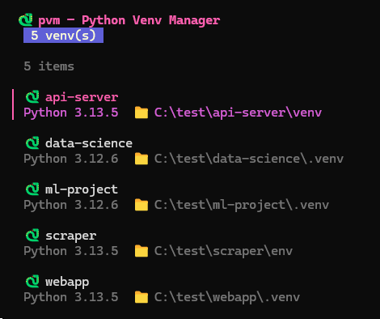
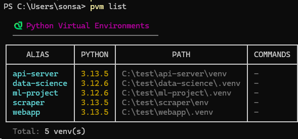

<h1 align="center">pvm</h1>

<p align="center">
  <b>A fast CLI to discover, alias, and run Python virtual environments — with an interactive TUI.</b>
</p>

<p align="center">
  <a href="https://github.com/Higangssh/pvm/releases/latest"></a>
  
  
  
</p>

<p align="center">
  
</p>

> Windows and macOS supported. Linux support planned.

## Features

- 🔍 **Auto-discovery** — scan any directory and register all venvs found
- 🏷️ **Aliases** — give each venv a short memorable name
- ⚡ **Run anywhere** — execute Python or any command inside a venv from a single CLI
- 🔖 **Saved commands** — bookmark frequently used commands per venv
- 🖥️ **Interactive TUI** — browse and pick venvs with arrow keys (`pvm ui`)
- 📦 **Single binary** — ~6 MB, no dependencies to install

## Install

Pick whichever you prefer:

### Option 1 — One-line install (auto PATH setup)

Windows:

```powershell
irm https://raw.githubusercontent.com/Higangssh/pvm/main/install.ps1 | iex
```

macOS:

```bash
curl -fsSL https://raw.githubusercontent.com/Higangssh/pvm/main/install.sh | sh
```

Downloads the latest binary and adds it to your user PATH. Restart your terminal, or `source` your shell rc, then run `pvm --help`.

### Option 2 — Manual download (no script)

1. Download the right binary from the [latest release](https://github.com/Higangssh/pvm/releases/latest).
   - Windows: `pvm.exe`
   - macOS Intel: `pvm-darwin-amd64`
   - macOS Apple Silicon: `pvm-darwin-arm64`
2. Rename it to `pvm` on macOS if needed, then place it somewhere on your `PATH`.
3. Run it:
   ```bash
   ./pvm --help
   ```

### Option 3 — Build from source (requires Go 1.21+)

```powershell
git clone https://github.com/Higangssh/pvm.git
cd pvm
go build -o pvm.exe .
```

macOS:

```bash
git clone https://github.com/Higangssh/pvm.git
cd pvm
go build -o pvm .
```

## Quick Start

```powershell
# 1. Discover every venv under a workspace
pvm scan C:\projects

# 2. See the list
pvm list

# 3. Run something
pvm shell my-app                  # open an activated cmd window
pvm exec my-app -- pip list       # run any command in the venv
pvm run  my-app script.py         # run python with args
```

## Commands

### Registry

| Command | Description |
|---|---|
| `pvm list` | Show all registered venvs (alias, Python version, path, saved commands) |
| `pvm scan <path>` | Recursively find venvs in a directory and register them (`-d` for max depth, default 4) |
| `pvm add <path> [-a alias]` | Register a venv manually |
| `pvm remove <alias>` | Unregister a venv |
| `pvm alias <old> <new>` | Rename an alias |

<p align="center">
  
</p>

### Execution

| Command | Description |
|---|---|
| `pvm run <alias> <py-args...>` | Run the venv's `python.exe` with the given args |
| `pvm exec <alias> -- <cmd...>` | Run any command with venv `PATH` and `VIRTUAL_ENV` injected |
| `pvm shell <alias>` | Open a new `cmd` window with the venv activated |

### Saved commands

| Command | Description |
|---|---|
| `pvm save <alias> <name> <cmd...>` | Save a custom command for a venv |
| `pvm do <alias> <name>` | Run a saved command |

### Interactive TUI

Run `pvm ui` for a full-screen browser (shown in the header above).

**Keybindings**: `enter`/`s` = shell · `r` = run · `x` = exec · `d` = remove · `/` = filter · `q` = quit

## Examples

```powershell
# Register all venvs under a workspace folder
pvm scan C:\projects
# + my-api    C:\projects\my-api\venv
# + my-app    C:\projects\my-app\.venv
# Added 2 venv(s).

# Quick Python check
pvm run my-api --version
# Python 3.12.0

# Install a package inside the venv
pvm exec my-api -- pip install requests

# Bookmark a common command
pvm save my-api serve python manage.py runserver 0.0.0.0:8000
pvm save my-api test  pytest -v

# Use the bookmark
pvm do my-api serve
pvm do my-api test

# Interactive mode
pvm ui
```

## `run` vs `exec` vs `shell`

- **`run`** — runs the venv's `python.exe`. Good for scripts and `python -m ...`.
- **`exec`** — runs any command with venv `PATH`/`VIRTUAL_ENV` injected. Use for `pip`, `pytest`, `django-admin`, etc.
- **`shell`** — opens an interactive shell with the venv activated. On Windows this uses `cmd`. On macOS it starts your current login shell in the current terminal session.

## Configuration

Stored at the standard user config directory:
- Windows: `%APPDATA%\\pvm\\config.json`
- macOS: `~/Library/Application Support/pvm/config.json`

It's plain JSON, feel free to edit by hand or back it up.

```json
{
  "venvs": [
    {
      "alias": "my-api",
      "path": "C:\\projects\\my-api\\venv",
      "commands": {
        "serve": "python manage.py runserver 0.0.0.0:8000",
        "test":  "pytest -v"
      }
    }
  ]
}
```

## Uninstall

### One-line uninstall

Windows:

```powershell
irm https://raw.githubusercontent.com/Higangssh/pvm/main/uninstall.ps1 | iex
```

macOS:

```bash
curl -fsSL https://raw.githubusercontent.com/Higangssh/pvm/main/uninstall.sh | sh
```

Removes the installed binary and optionally deletes the config file.

### Manual uninstall

```powershell
# 1. Remove the binary folder
Remove-Item -Recurse -Force "$env:LOCALAPPDATA\pvm"

# 2. (Optional) Remove your saved venv list
Remove-Item -Recurse -Force "$env:APPDATA\pvm"

# 3. Remove from PATH
#    Win + R -> sysdm.cpl -> Advanced -> Environment Variables
#    Edit user `Path` -> remove the `...\AppData\Local\pvm` entry
```

No services, registry entries, or background processes are ever created — pvm is just an executable file.

## Roadmap

- [ ] Linux support
- [ ] `pvm create <path>` — create new venvs
- [ ] `pvm pip-freeze` / `pvm pip-sync` across venvs
- [ ] Per-project `.pvm` file to auto-select venv
- [ ] Packaged releases (scoop, winget, brew)

## License

MIT
